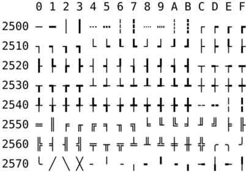

---
1008 출력하기08
---
문제
---
이번에는 특수문자를 출력하는 연습을 해보자.

키보드로 입력할 수 없는 다음 모양을 출력해보자.   
(** 참고 : 운영체제의 문자 시스템에 따라 아래와 같은 모양이 출력되지 않을 수 있다.)

┌┬┐   
├┼┤   
└┴┘

>참고

다음과 같은 유니코드로 특수문자를 표현한다고 하자.   
(운영체제 또는 컴파일러에 따라 사용되는 문자의 코드표가 다르다.)



**금지 키워드 : ┌ ┬ ┐ ├ ┼ ┤ └ ┴ ┘**
---
>입력 

입력없음  

---

>출력   

┌┬┐   
├┼┤   
└┴┘   
를 유니코드를 이용하여 출력한다.

---
제출
---
```java
public class Main {
	public static void main(String[] args) {
		System.out.println("\u250C\u252C\u2510\n\u251C\u253C\u2524\n\u2514\u2534\u2518");
	}
}
```
---
해석
---

* 첫 고비(?)였다.
* 자바에서 유니코드를 출력하기 위해서는 \\ + u + 유니코드를 사용한다. (ex \u251C)
---