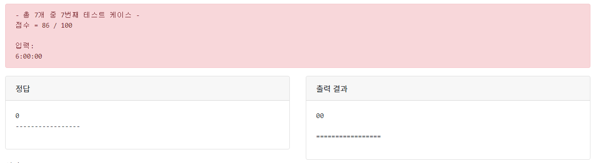

---
1026 시분초 입력받아 분만 출력하기
---
문제
---
입력되는 시:분:초 에서 분만 출력해보자.

---
### 입력 

시 분 초가   
시:분:초 형식으로 입력된다.

---
### 출력   

분만 출력한다.


---
### 입력 예시

17:23:57

---
### 출력 예시

23

---
제출
---
```java
import java.util.Scanner;

public class Main {

	public static void main(String[] args) {
		Scanner scan = new Scanner(System.in);
		String input = scan.next();
		String[] arr = input.split(":");
		System.out.println(arr[1].equals("00")?"0":arr[1]);
	}
}
```
---
풀이

* 문제가 그지 같아서 억지로 "00"일때 "0"으로 맞춤.
---
