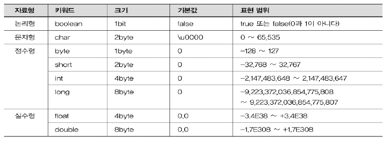

---
1029 실수 1개 입력받아 그대로 출력하기2
---
문제
---
실수 1개를 입력받아 그대로 출력해보자.   
(단, 입력되는 실수의 범위는 +- `1.7*10**-308 ~ +- 1.7*10**308` 이다.)

---
### 입력 

소수점 아래 숫자가 11개 이하인 실수 1개가 입력된다.   
(단, 입력되는 실수의 범위는 `+- 1.7*10**-308 ~ +- 1.7*10**308 `이다.)


---
### 출력   

입력된 실수를 소수점 이하 11자리까지 반올림하여 출력한다.

---
### 입력 예시

3.14159265359

---
### 출력 예시

3.14159265359

---
제출
---
```java
import java.util.Scanner;

public class Main {

	public static void main(String[] args) {
		Scanner scan = new Scanner(System.in);
		System.out.printf("%.11f", scan.nextDouble());
	}
}
```
---
### 풀이
* %.11f 를 이용하면 소숫점 11자리에서 반올림하여 보여줌

---

> 참고 : 자바의 자료형
> 
